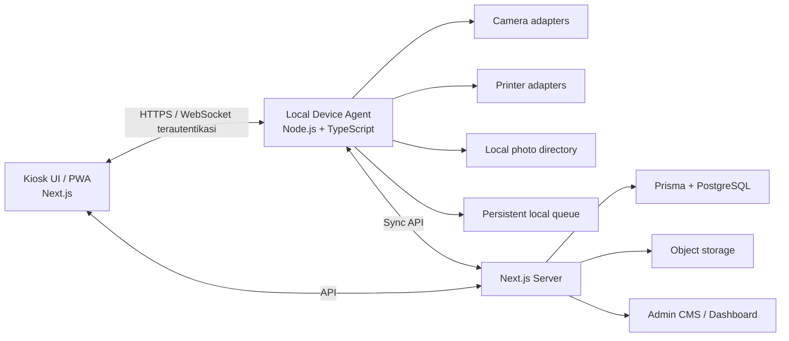
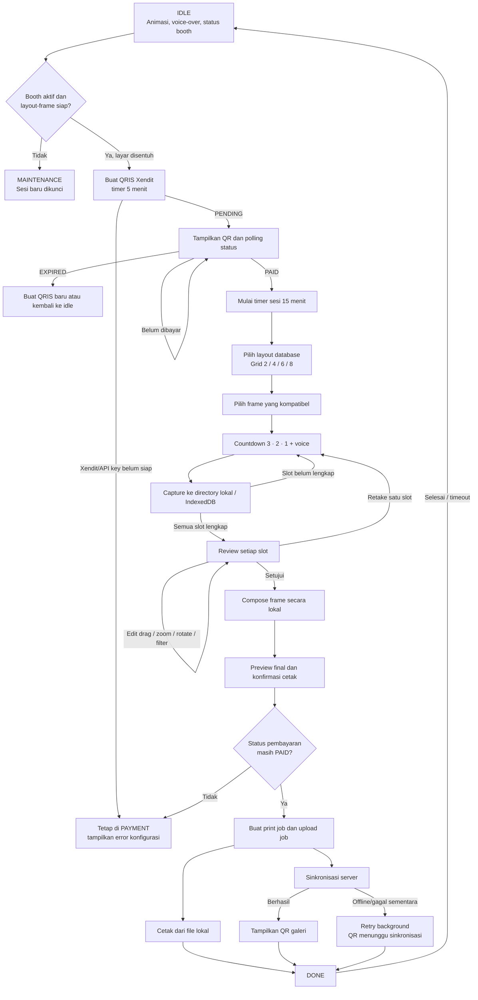

# Snapore Photobooth — Master Prompt dan Spesifikasi Sistem

> Status dokumen: **implementasi MVP dimulai pada 4 Agustus 2026** setelah pemilik project memberikan perintah **"mulai implementasi"**. Bagian spesifikasi di bawah tetap menjadi source of truth untuk fase lanjutan.

## Implementasi yang tersedia

Repository sekarang berisi vertical slice Snapore yang mencakup:

- Next.js App Router, React, TypeScript, dan responsive PWA shell;
- Prisma ORM 7 dengan schema PostgreSQL, initial migration, dan seed data;
- command center dashboard, session archive, CMS/frame settings, dan kiosk flow;
- capture kamera laptop/webcam asli melalui `getUserMedia()` dengan penanganan izin dan retry;
- penyimpanan capture ke local directory melalui device agent;
- fallback IndexedDB ketika device agent tidak tersedia;
- browser image composition untuk layout grid 2, 4, 6, dan 8;
- editor per-slot untuk drag positioning, pinch zoom, two-finger twist rotation, rotate button, mirror, brightness, filter, serta retake individual pada grid 2/4/6/8;
- dua belas frame PNG transparan bawaan untuk kombinasi Sunset Punch, Electric Mint, dan Blue Hour × grid 2/4/6/8;
- admin tenant dapat menambahkan satu set frame baru melalui upload PNG Grid 2/4/6/8 untuk booth tertentu; metadata versi, path, checksum, dan status publikasi disimpan ke PostgreSQL;
- multi-tenant persistence dengan UUID untuk seluruh primary ID, user berbasis role, booth UUID URL, dan isolasi frame per tenant/booth;
- super admin console untuk membuat tenant, user, booth, mengatur pajak/biaya, menyimpan secret Xendit terenkripsi, serta melihat penjualan dan laba bersih per booth/device;
- kontrol aktif/nonaktif booth serta maintenance otomatis ketika layout dan frame database yang kompatibel belum tersedia;
- integrasi Xendit Payments API untuk QRIS one-time-use, polling status, webhook terverifikasi, idempotensi webhook, dan payment gate yang hanya menerima status `PAID`;
- reset sesi terbayar melalui kode 6 digit sekali pakai dari Super Admin tanpa meminta pelanggan membayar ulang;
- print job dan upload job terpisah yang dipicu saat konfirmasi cetak;
- local persistent agent queue, atomic file write, SHA-256 checksum, dan background retry;
- Windows print spooler bridge dengan discovery queue fisik, auto-connect/reconnect, silent photo print, profil Epson/DNP, dan mock printer yang hanya aktif bila dipilih eksplisit untuk development;
- opsi DNP DS-RX `2 inch cut` per frame, dengan routing ke SDK bridge vendor atau queue Windows khusus yang driver-nya mengaktifkan `2inch cut`;
- server sync endpoint, protected gallery token, dan QR result setelah sinkronisasi;
- fallback sinkronisasi langsung dari browser dengan retry otomatis ketika device agent tidak aktif, sehingga QR galeri tetap muncul setelah server menerima file;
- Docker Compose PostgreSQL, unit tests, lint, typecheck, dan production build scripts.

Printer foto fisik tetap membutuhkan driver Windows resmi vendor dan hardware acceptance test. `OS_SPOOLER` adalah mode default, menemukan queue fisik secara otomatis, dan gagal secara aman jika queue offline atau profil cutting tidak siap; mode `mock` hanya untuk pengujian yang diaktifkan secara eksplisit.

## Menjalankan aplikasi lokal

Prasyarat: Node.js 20.19+, npm, dan PostgreSQL. Konfigurasi lokal saat ini menargetkan `jdbc:postgresql://localhost:5432/postgres` dengan user `postgres`; Prisma memakai connection string ekuivalen dari `.env`. Cara alternatif menyiapkan PostgreSQL adalah Docker Desktop.

```bash
npm install
docker compose up -d
npm run db:generate
npm run db:migrate
npm run db:seed
```

Jalankan web app dan local device agent di dua terminal:

```bash
npm run dev
```

```bash
npm run agent:dev
```

Buka:

- `http://localhost:3000/login` untuk login admin;
- `http://localhost:3000/super-admin` untuk control plane global;
- `http://localhost:3000` untuk dashboard tenant;
- `http://localhost:3000/kiosk/<booth-uuid>` untuk flow pelanggan per booth;
- `http://localhost:3000/admin` untuk CMS tenant dan upload frame per booth;
- `http://127.0.0.1:4545/health` untuk status local device agent.

## Build aplikasi desktop Windows

Versi desktop membungkus Next.js standalone dan device agent dalam Electron. Kamera laptop tetap memakai `getUserMedia()`, sedangkan discovery/print DNP dan Epson tetap berjalan melalui bridge PowerShell/SDK lokal.

```bash
# Jalankan versi desktop dari source (production runtime)
npm run desktop:start

# Buat installer NSIS dan executable portable Windows x64
npm run desktop:dist
```

Hasil build tersedia di `release/`. Installer tidak menyertakan `.env`, password, atau upload development. Saat pertama dibuka, Snapore membuat `snapore.env` dan `desktop.config.json` di `%APPDATA%\Snapore Desktop`; isi `DATABASE_URL` di sana, kemudian buka ulang aplikasi. Detail seluruh command, pengaturan kiosk/fullscreen, direktori data, dan distribusi tersedia di [docs/desktop-build.md](docs/desktop-build.md).

### Auto-detect kamera dan SDK bridge

- Kamera browser pada laptop, tablet, dan handphone dideteksi ulang saat perangkat dipasang/dilepas. Desktop memprioritaskan DSLR webcam utility atau webcam USB; perangkat mobile memprioritaskan kamera depan.
- Canon EDSDK dijalankan melalui executable bridge lokal pada `SNAPORE_CANON_SDK_BRIDGE`. SDK vendor lain memakai `SNAPORE_CAMERA_SDK_BRIDGE` dan nama adapter pada `SNAPORE_CAMERA_SDK_KIND`.
- Bridge menerima perintah `discover --json`, `connect --device <id>`, `disconnect --device <id>`, `capabilities --device <id> --json`, dan `capture --device <id> --output <file.jpg>`.
- Jika bridge SDK gagal atau kamera dilepas, kiosk otomatis jatuh kembali ke MediaDevices browser. Binary dan lisensi SDK resmi vendor tetap harus dipasang pada komputer booth.

### Auto-connect DNP dan Epson

- Jalankan `npm run agent:dev` pada PC booth Windows. Agent memindai printer setiap 5 detik, mengabaikan printer virtual, memprioritaskan DNP lalu Epson, dan menyambungkan ulang queue preferred yang disimpan dari menu Admin → Devices.
- Epson photo/inkjet menggunakan driver Windows untuk ukuran media, photo paper, borderless, dan color management. `SNAPORE_EPSON_SDK_BRIDGE` hanya perlu diisi jika tersedia executable SDK vendor khusus model printer tersebut.
- Untuk DNP DS-RX1/RX1HS, frame bertanda **DNP 2″ CUT** hanya dicetak bila `SNAPORE_DNP_SDK_BRIDGE` tersedia atau `dnpCutQueueName` menunjuk queue Windows duplikat yang opsi driver **2inch cut**-nya aktif. Ini mencegah job strip tercetak sebagai foto 4×6 tanpa potong.
- Protokol executable printer vendor: `print --queue <name> --file <path> --copies <n> --media <size> --dpi <n> --borderless <bool> --photo-paper <bool> --two-inch-cut <bool> --job-id <id>`. Tulis JSON `{ "spoolerId": "...", "status": "SPOOLING" }` ke stdout.
- Telemetry SDK opsional memakai `status --queue <name> --json` dan mengembalikan `{ "paperRemaining": 120, "paperCapacity": 400 }`. Jika tidak tersedia, dashboard memakai counter `ESTIMATED` yang diisi operator dan berkurang satu lembar per copy; sumber `SENSOR`/`ESTIMATED` selalu ditampilkan.
- Kiosk mengirim heartbeat kamera, printer, queue, dan status koneksi setiap lima detik. Dashboard tenant refresh otomatis setiap sepuluh detik dan menampilkan perangkat per booth, sisa media, peringatan menipis, serta notifikasi habis.
- Pengaturan frame menyediakan toggle cutting khusus DNP. Card frame menampilkan badge **DNP 2″ CUT**, sehingga operator dapat melihat frame mana yang dipotong tanpa membuka editor.

Akun development awal dibuat oleh seed menggunakan `SUPER_ADMIN_EMAIL` dan `SUPER_ADMIN_PASSWORD` dari `.env`. Akun tenant awal memakai `admin@snapore.local` dengan password awal yang sama. Ganti seluruh credential sebelum deployment.

### Multi-tenant, payment, dan laba bersih

- `Tenant` memiliki user, booth, frame, pricing, pajak, biaya per cetak, dan konfigurasi payment sendiri.
- Super Admin memakai sidebar untuk overview, tambah/daftar tenant, user, booth, payment & pajak, sales, dan shortcut workspace masing-masing tenant.
- User dapat diedit oleh Super Admin, termasuk nama, email, tenant, role, status aktif, dan reset password opsional. Workspace tenant memuat Xendit/pajak serta upload frame yang hanya dapat diarahkan ke booth tenant tersebut.
- API key dan webhook token Xendit dienkripsi AES-256-GCM menggunakan `APP_ENCRYPTION_KEY`; UI hanya mengembalikan empat karakter terakhir.
- QRIS dibuat melalui `POST /api/payments/qris` menggunakan Xendit Payment Requests API. Webhook ditangani di `/api/payments/xendit/webhook` dengan verifikasi `x-callback-token` dan deduplikasi `webhook-id`.
- QRIS muncul setelah layar idle disentuh dengan window pembayaran 5 menit. Kiosk tidak dapat melewati tahap pembayaran sebelum Xendit mengembalikan status `PAID`; `PENDING`, `EXPIRED`, `NOT_REQUIRED`, atau konfigurasi Xendit kosong tidak membuka sesi.
- Setelah pembayaran berhasil, timer sesi 15 menit terus berjalan dari pemilihan layout sampai hasil selesai.
- Untuk harga termasuk pajak: `pajak = gross - gross / (1 + taxRate)`. Laba bersih per order: `gross - pajak - biaya cetak - fee payment`.
- Device agent untuk setiap booth harus memakai `SNAPORE_BOOTH_CODE` yang sama dengan kode booth di database agar hasil cetak tercatat pada perangkat dan booth yang benar.

Foto development tersimpan di `snapore-data/`, sedangkan hasil sinkronisasi server lokal tersimpan di `server-uploads/`. Kedua directory tidak masuk version control.

### Validasi

```bash
npm run typecheck
npm run lint
npm test
npm run build
```

## Cara menggunakan dokumen ini

Gunakan seluruh isi README ini sebagai master prompt untuk AI coding agent yang nantinya membangun Snapore. AI wajib membaca semua bagian, mencatat asumsi, mengusulkan rencana implementasi, lalu menunggu persetujuan sebelum menulis kode.

## Peran AI saat implementasi dimulai

Anda adalah software architect dan senior full-stack engineer yang berpengalaman membangun aplikasi kiosk, sistem offline-first, integrasi kamera, image composition, payment flow, device discovery, dan printer automation.

Tugas Anda kelak adalah membangun sistem photobooth bernama **Snapore** dengan Next.js, TypeScript, Prisma, database server, penyimpanan lokal yang tahan gangguan internet, serta local device agent untuk mengendalikan kamera dan printer. Jangan menyederhanakan kebutuhan perangkat keras menjadi API browser biasa.

Sebelum menulis kode, wajib:

1. Audit repository dan dokumen ini.
2. Tampilkan arsitektur, struktur folder, ERD, state machine, kontrak API, dan rencana fase implementasi.
3. Tandai integrasi yang membutuhkan driver/SDK vendor.
4. Ajukan hanya pertanyaan yang benar-benar mengubah arsitektur atau alur bisnis.
5. Tunggu persetujuan pemilik project.

---

## 1. Tujuan produk

Snapore adalah platform photobooth kiosk yang:

- dapat melakukan sesi foto menggunakan kamera laptop, kamera tablet, webcam USB, atau DSLR;
- dapat mencetak secara otomatis melalui printer thermal, DNP photo printer, atau Epson inkjet;
- otomatis menemukan, menghubungkan kembali, dan memantau perangkat yang sudah dipasangkan;
- tetap dapat mengambil foto dan mencetak ketika internet terputus;
- selalu menyimpan hasil pengambilan foto ke directory lokal terlebih dahulu;
- baru membuat antrean upload ke server ketika pengguna mengonfirmasi proses cetak;
- memiliki kiosk UI untuk pelanggan, operator tools, dan CMS/dashboard admin;
- mendukung banyak booth di masa depan, walaupun versi awal boleh berfokus pada satu booth.

## 2. Prinsip wajib

1. **Offline-first:** capture, composition, payment state lokal yang diperlukan, dan print tidak boleh bergantung pada koneksi server.
2. **Local-first storage:** file foto tidak langsung di-upload pada saat tombol capture ditekan.
3. **Upload on print:** upload dipicu ketika print job dikonfirmasi/dibuat, bukan saat capture.
4. **Print tidak diblokir internet:** jika server tidak tersedia, print lokal tetap berjalan dan upload masuk retry queue.
5. **Tidak ada kehilangan data:** gunakan status persisten, checksum, retry dengan backoff, dan operasi idempotent.
6. **Hardware abstraction:** setiap kamera dan printer menggunakan adapter/driver interface yang konsisten.
7. **Automatic reconnect:** perangkat yang sudah dipasangkan harus dicoba sambungkan kembali setelah restart, kabel terlepas, atau perangkat hidup kembali.
8. **Kiosk-safe:** antarmuka sederhana, touch-friendly, fullscreen, ada timeout, dan selalu dapat pulih ke halaman idle.
9. **Configurable:** layout, frame, harga, jumlah foto, durasi countdown, printer profile, dan idle media tidak boleh di-hardcode.
10. **Secure by default:** local device agent tidak boleh menjadi endpoint publik tanpa autentikasi dan pairing.

## 3. Aktor sistem

- **Pelanggan:** menjalankan sesi foto, memilih layout/frame/foto, melihat preview, menentukan jumlah cetak, membayar jika fitur pembayaran aktif, lalu mencetak.
- **Operator booth:** memilih perangkat, memeriksa status kamera/printer, mengatur paper counter, menangani antrean gagal, dan melakukan reprint sesuai izin.
- **Admin:** mengelola booth, template, frame, harga, idle media, transaksi, data sesi, user, dan laporan.
- **Local device agent:** menjembatani aplikasi web dengan filesystem, DSLR, webcam tertentu, OS print spooler, serta printer USB/LAN.
- **Server:** menyimpan metadata, hasil yang memang harus disinkronkan, konfigurasi terpusat, audit, dan galeri/QR hasil.

## 4. Arsitektur tingkat tinggi

Gunakan arsitektur hybrid, bukan browser-only.



### Komponen yang diminta

1. **Next.js App Router + TypeScript**
   - kiosk/customer UI;
   - operator UI;
   - CMS/dashboard admin;
   - server API dan autentikasi;
   - PWA/offline shell bila sesuai.

2. **Prisma**
   - PostgreSQL untuk data server/production;
   - local SQLite melalui Prisma atau persistent embedded store setara untuk queue dan state pada device agent;
   - jika memakai dua datasource, pisahkan schema/generated client agar tidak rancu.

3. **Local Device Agent**
   - service lokal berbasis Node.js + TypeScript;
   - berjalan otomatis saat komputer kiosk menyala;
   - menyediakan API localhost/LAN yang terautentikasi;
   - mengelola local directory, device discovery, capture DSLR bila diperlukan, print spool, health check, retry queue, dan heartbeat;
   - mendukung Windows sebagai target awal, tetapi interface driver harus siap dikembangkan untuk macOS/Linux.

4. **Object storage server**
   - gunakan adapter S3-compatible agar dapat memakai S3, Cloudflare R2, MinIO, atau provider lain;
   - database hanya menyimpan metadata/path/checksum, bukan binary foto besar.

### Batasan platform yang tidak boleh diabaikan

- `getUserMedia()` dapat digunakan untuk kamera laptop, tablet, dan mayoritas webcam.
- Browser tidak dapat mengendalikan semua DSLR, DNP, Epson, atau thermal printer secara langsung.
- DSLR memerlukan adapter vendor, `gphoto2`, digiCamControl, remote tethering, atau SDK resmi sesuai OS/model.
- DNP dan Epson umumnya membutuhkan driver OS/vendor yang sudah terpasang.
- Printer thermal dapat membutuhkan ESC/POS melalui USB/LAN/serial atau OS spooler.
- Pada tablet, browser/PWA menyimpan file di OPFS/IndexedDB jika tidak memiliki akses ke directory biasa. Untuk print, tablet berkomunikasi dengan print host/local agent di jaringan lokal.
- Istilah **otomatis connect** berarti auto-discovery, pairing awal, penyimpanan preferred device, health check, dan auto-reconnect. Ini tidak berarti sistem dapat melewati instalasi driver vendor atau izin OS.

## 5. Alur pelanggan/kiosk yang berlaku

Flow kiosk diimplementasikan sebagai state machine `IDLE -> PAYMENT -> LAYOUT -> FRAME -> CAPTURE -> REVIEW -> CHECKOUT -> PRINTING -> DONE`. Pembayaran berada sebelum pengambilan foto dan bersifat fail-closed.



### Detail setiap tahap

#### A. IDLE dan kesiapan booth

- Idle menampilkan animasi photostrip, pose bergantian, flash, headline bergerak, CTA pulse, dan voice-over perempuan Indonesia.
- `prefers-reduced-motion` menghentikan animasi berulang untuk aksesibilitas.
- Sebelum sesi dimulai, server memeriksa status tenant, `kioskEnabled`, maintenance, layout aktif/published, dan frame tenant/booth yang kompatibel.
- Booth tanpa kombinasi layout-frame yang valid otomatis masuk maintenance. Admin tenant dan Super Admin dapat mengaktifkan atau menonaktifkan booth.

#### B. PAYMENT — QRIS wajib

- Sentuhan pada idle membuat QRIS Xendit sekali pakai dan memulai countdown pembayaran 5 menit.
- Kiosk tetap berada pada halaman pembayaran selama status `PENDING` dan melakukan polling selain menerima webhook.
- Hanya status `PAID` yang menjalankan transisi `PAYMENT_COMPLETE`; `NOT_REQUIRED`, `PENDING`, `FAILED`, `EXPIRED`, dan konfigurasi kosong tidak dapat membuka sesi.
- Jika Xendit belum aktif atau API key tenant belum disimpan, UI menampilkan error konfigurasi dan tidak membuat sesi gratis.
- Setelah `PAID`, timer sesi 15 menit dimulai dan terus berjalan sampai `DONE` atau habis.

#### C. Pilih layout dan frame

- Layout yang tersedia adalah Grid 2, 4, 6, dan 8 yang aktif, memiliki versi published, serta mempunyai frame kompatibel di PostgreSQL.
- Kiosk tidak menggunakan frame dummy ketika katalog database kosong atau gagal dimuat.
- Frame tenant-global atau frame khusus booth diperbolehkan; frame milik booth/tenant lain ditolak saat validasi checkout.

#### D. Countdown dan capture lokal

- Countdown default tiga detik disertai cue suara `Tiga`, `Dua`, `Satu`, dan `Senyum`.
- Hasil capture disimpan terlebih dahulu ke directory local device agent; IndexedDB menjadi fallback browser.
- Tidak ada upload foto pada tahap capture atau review.
- Grid berulang sampai seluruh 2/4/6/8 slot terisi.

#### E. Review, retake, dan edit

- Setiap slot dapat di-retake secara individual tanpa mengulang slot lain atau pembayaran.
- Editor mendukung drag satu jari/mouse, pinch zoom, twist dua jari, rotate button, mirror, brightness, dan filter.
- Hasil edit disimpan sebagai revisi lokal baru, kemudian composite print-ready dibuat secara lokal bersama overlay frame PNG.
- Jika terjadi kendala sebelum print, Super Admin dapat membuat kode reset 6 digit sekali pakai dengan masa berlaku 10 menit. Kode mengulang flow dari pemilihan layout menggunakan sesi yang sudah dibayar.

#### F. Checkout, print, dan sinkronisasi

- Preview final MVP menampilkan satu copy, harga paket, pajak, dan total yang sudah dibayar. API/order sudah menyimpan biaya cetak, fee payment, serta laba bersih untuk laporan admin.
- Model order mendukung copy tambahan, tetapi kontrol jumlah copy pada kiosk belum diaktifkan pada UI MVP.
- Sebelum membuat job, server memvalidasi ulang bahwa pembayaran sesi masih `PAID` dan layout-frame masih valid.
- Konfirmasi print membuat print job serta upload job terpisah dan idempotent.
- Print selalu membaca composite lokal. Upload yang gagal tidak membatalkan print yang sah dan masuk retry queue.
- QR galeri baru ditampilkan setelah server berhasil menerima asset; selama belum berhasil UI menampilkan status sinkronisasi/menunggu.

#### G. DONE dan reset

- Halaman selesai menampilkan status cetak dan QR galeri ketika tersedia.
- Setelah selesai atau timer sesi habis, UI kembali ke idle tanpa menghapus print/upload queue yang masih berjalan.

## 6. State machine sesi dan job

Pisahkan status sesi, pembayaran, upload, dan print supaya error pada satu proses tidak merusak proses lain.

### Session status

`CREATED -> LAYOUT_SELECTED -> CAPTURING -> REVIEWING -> COMPOSED -> CHECKOUT -> COMPLETED`

Terminal tambahan: `CANCELLED`, `EXPIRED`, `FAILED`. Session terminal tidak otomatis berarti file boleh dihapus.

### Payment status

`NOT_REQUIRED | PENDING | PAID | FAILED | EXPIRED | REFUNDED`

Untuk flow kiosk QRIS saat ini, hanya `PAID` yang dapat membuka sesi atau membuat print job. `NOT_REQUIRED` dipertahankan pada schema untuk kompatibilitas histori/mode lain, tetapi tidak diterima oleh payment gate kiosk.

### Upload job status

`WAITING_FOR_PRINT_TRIGGER | QUEUED | UPLOADING | SYNCED | RETRYING | FAILED_PERMANENT`

### Print job status

`QUEUED | SPOOLING | PRINTING | PRINTED | RETRYING | FAILED | CANCELLED`

Catat setiap transisi penting dalam event/audit log dengan timestamp, booth, device, actor, error code, dan correlation ID.

## 7. Penyimpanan lokal dan kebijakan sinkronisasi

### Struktur directory yang diharapkan

Gunakan root directory yang dapat dikonfigurasi. Contoh:

```text
snapore-data/
  {boothId}/
    2026-08-04/
      {sessionId}/
        originals/
          {photoId}.jpg
        thumbnails/
          {photoId}.webp
        composites/
          print-{compositionId}.jpg
          preview-{compositionId}.webp
        metadata.json
        manifest.json
```

### Aturan penyimpanan

- Gunakan UUID/ULID; jangan memakai nama file dari input pengguna.
- Penulisan file harus atomic: tulis ke temporary file dalam directory yang sama, validasi, lalu rename.
- Hitung checksum SHA-256 untuk setiap asset.
- `manifest.json` menyimpan versi schema, daftar asset, checksum, capture source, layout, frame, dan status sync.
- Jangan tandai asset `SYNCED` sebelum server mengonfirmasi checksum/object key.
- Queue harus tetap ada setelah browser ditutup, service restart, atau listrik mati mendadak.
- Upload mendukung resume/multipart untuk file besar jika provider mendukung.
- Retry memakai exponential backoff + jitter dan dapat dipicu manual oleh operator.
- Cleanup hanya untuk asset yang memenuhi retention policy dan tidak memiliki job aktif/gagal.
- Foto dari sesi batal/tidak dicetak tetap lokal dan tidak dikirim ke server secara default; hapus otomatis sesuai retention policy.

### Default retention yang boleh dipakai sampai admin mengubahnya

- sesi batal/tidak dicetak: 24 jam;
- sesi dicetak tetapi belum sinkron: jangan dihapus;
- sesi sudah sinkron: simpan lokal 7 hari;
- semua nilai harus dapat dikonfigurasi per booth.

## 8. Dukungan kamera

Buat kontrak `CameraAdapter` konseptual dengan operasi minimal:

- `discover()`;
- `connect(deviceId)`;
- `disconnect()`;
- `getCapabilities()`;
- `startPreview()` / `stopPreview()`;
- `capture()`;
- `setConfig()` bila device mendukung;
- `getHealth()`;
- event `connected`, `disconnected`, `captureReady`, dan `error`.

### Adapter minimum

1. **Laptop/tablet camera:** MediaDevices/getUserMedia.
2. **USB webcam:** MediaDevices; native adapter opsional untuk kontrol lanjutan.
3. **DSLR tethered:** adapter terpisah berdasarkan driver/SDK yang tersedia.
4. **Remote tablet camera:** browser tablet melakukan capture lokal dan mengirim hasil ke session host melalui koneksi LAN yang terautentikasi bila tablet bukan layar kiosk utama.

### Konfigurasi kamera

- preferred camera per booth;
- resolution dan aspect ratio;
- front/rear lens pada tablet;
- mirror preview versus mirror output;
- orientation/rotation;
- autofocus/manual focus jika SDK mendukung;
- ISO, aperture, shutter, white balance jika DSLR adapter mendukung;
- capture timeout dan retry;
- fallback camera dan pesan operator.

## 9. Dukungan printer

Buat kontrak `PrinterAdapter` konseptual dengan operasi minimal:

- `discover()`;
- `connect(printerId)`;
- `getCapabilities()`;
- `getStatus()`;
- `print(file, profile, copies)`;
- `cancel(jobId)` jika didukung;
- `getQueue()`;
- event `connected`, `disconnected`, `paperLow`, `paperOut`, `jobUpdated`, dan `error`.

### Adapter minimum

1. **Generic OS spooler:** jalur utama untuk printer dengan driver terpasang.
2. **DNP photo printer:** gunakan driver/vendor support, media size, status, dan finishing yang tersedia.
3. **Epson inkjet:** gunakan OS spooler atau SDK resmi untuk paper size, borderless, quality, dan color profile.
4. **Thermal/ESC-POS:** USB/LAN/serial untuk receipt atau raster image monokrom sesuai kemampuan printer.

### Printer profile

Setiap profile menyimpan:

- printer adapter dan OS device ID;
- ukuran media, orientasi, DPI, margin/bleed;
- mode borderless;
- color profile/ICC bila tersedia;
- crop/fit strategy;
- jenis output: `PHOTO`, `RECEIPT`, atau `BOTH`;
- max copies;
- default printer dan fallback printer;
- estimated media capacity dan software paper counter.

Paper counter dari dashboard harus dianggap estimasi kecuali printer memang menyediakan sensor/status akurat. Operator dapat melakukan reset setelah mengganti media dan semua perubahan harus diaudit.

### Perilaku automatic connection

- scan USB/LAN/OS spooler saat agent start dan secara periodik;
- simpan device fingerprint, bukan hanya display name;
- prioritaskan preferred device;
- lakukan reconnect dengan backoff;
- jangan berpindah diam-diam ke printer lain jika ukuran media/profile tidak kompatibel;
- tampilkan alasan perangkat tidak siap: driver hilang, offline, paper out, media mismatch, permission denied, atau job stuck.

## 10. CMS dan dashboard

### Dashboard utama

- status online/offline semua booth;
- last heartbeat;
- kamera aktif dan statusnya;
- printer aktif, antrean, error, serta paper counter;
- jumlah sesi, hasil cetak, upload tertunda/gagal, omzet, dan payment status;
- maintenance toggle per booth;
- notifikasi device disconnected, storage hampir penuh, upload backlog, paper low/out, dan print gagal.

### Manajemen layout dan frame

- upload PNG/WebP transparan;
- buat layout grid 2/4/6 atau layout custom;
- editor slot foto dengan posisi `x`, `y`, `width`, `height`, rotation, crop mode, mask, border radius, dan z-index;
- preview berdasarkan ukuran output sebenarnya;
- sort drag-and-drop;
- active/inactive;
- schedule `activeFrom` dan `activeUntil`;
- versioning agar sesi lama tetap merujuk versi frame yang benar;
- validasi dimensi/resolusi sebelum publish.

### Pricing dan payment settings

- harga dasar per layout/package/media size;
- harga tambahan per copy;
- tax/service fee opsional;
- payment on/off;
- provider configuration disimpan terenkripsi;
- aturan promo/campaign dapat ditambahkan kemudian tanpa mengubah core print flow.

### Idle media dan gamification

- upload/sort image atau video idle;
- duration, mute, schedule, dan target booth;
- opsi game/high score sesuai sketsa sebagai modul yang dapat dinonaktifkan;
- game tidak boleh mengganggu core photo flow.

### Data pelanggan, sesi, dan reprint

- pencarian berdasarkan session code, tanggal, booth, dan payment reference;
- galeri thumbnail dengan akses sesuai role;
- detail timeline sesi, selected photos, composition, upload, payment, dan print jobs;
- tombol reprint harus membuat print job baru, mencatat actor/alasan, dan mengikuti kebijakan pembayaran/izin;
- popup preview foto tidak boleh otomatis memuat original penuh jika thumbnail cukup;
- export laporan tanpa mengekspos public asset URL permanen.

### User dan role

Minimal role: `SUPER_ADMIN`, `ADMIN`, `OPERATOR`, dan `VIEWER`. Terapkan authorization di server, bukan hanya menyembunyikan tombol di UI.

## 11. Model data konseptual Prisma

Jangan langsung menyalin daftar ini menjadi schema tanpa normalisasi dan review. Siapkan ERD untuk entitas minimum:

- `User`, `Role`, `UserRole`, `AuditLog`;
- `Booth`, `BoothSetting`, `Device`, `DeviceHeartbeat`;
- `CameraProfile`, `PrinterProfile`, `PaperCounter`;
- `Layout`, `LayoutVersion`, `LayoutSlot`;
- `Frame`, `FrameVersion`, `IdleMedia`;
- `PhotoSession`, `CapturedPhoto`, `Composition`, `Asset`;
- `PricingRule`, `Order`, `OrderItem`;
- `Payment`, `PaymentEvent`;
- `PrintJob`, `PrintAttempt`;
- `UploadJob`, `UploadAttempt`;
- `Gallery`, `GalleryToken`;
- `SystemEvent` atau domain event setara.

Semua record penting menggunakan timezone-aware timestamp, unique constraint yang jelas, soft delete bila relevan, optimistic concurrency/version, dan idempotency key untuk mutation dari perangkat.

## 12. API dan komunikasi realtime

Rancang kontrak API versioned dan typed. Minimum domain endpoint/event:

- booth registration, pairing, config pull, dan heartbeat;
- device discovery/status/capability;
- create/resume/cancel/complete session;
- frame/layout catalog dan version sync;
- payment create/status/webhook/manual confirmation;
- create/update/retry print job;
- initiate upload, presigned part upload, finalize, dan checksum confirmation;
- issue/revoke/expire gallery token;
- dashboard metrics dan session search;
- CMS CRUD dengan audit trail.

Gunakan WebSocket atau Server-Sent Events untuk device/job status jika berguna, tetapi core state tetap harus dapat dipulihkan dari database. Event realtime bukan source of truth.

## 13. Keamanan dan privasi

- Gunakan authentication yang aman untuk admin/operator dan short-lived device credentials untuk booth.
- Pairing perangkat membutuhkan kode/approval admin dan dapat dicabut.
- Batasi local agent ke `localhost` secara default; mode LAN harus memakai pairing, allowlist origin, token, dan idealnya TLS.
- Validasi MIME, magic bytes, dimensi, ukuran, dan nama asset upload.
- Public gallery memakai random short-lived token; jangan mengekspos object storage key langsung.
- Enkripsi secret provider dan jangan kirim secret admin ke kiosk.
- Terapkan rate limit untuk auth, payment, gallery, dan sync API.
- Simpan consent/retention setting sesuai kebijakan bisnis.
- Sediakan delete/anonymize workflow yang juga menghapus object storage dan mencatat audit tanpa menyimpan data foto yang dihapus.
- Log tidak boleh menyimpan binary, access token, payment secret, atau data pribadi yang tidak diperlukan.

## 14. Ketahanan dan penanganan error

Sistem wajib memiliki perilaku jelas untuk:

- internet mati sebelum/sesudah pembayaran;
- server restart ketika upload berjalan;
- browser refresh atau kiosk app crash;
- local agent restart;
- listrik mati setelah payment tetapi sebelum print;
- kamera terlepas saat countdown/capture;
- printer offline, paper out, media mismatch, atau job stuck;
- file local rusak/checksum berbeda;
- storage hampir penuh;
- duplicate webhook/payment callback;
- tombol print ditekan berkali-kali;
- server menerima upload/session yang sama lebih dari sekali.

Gunakan outbox/queue persisten, idempotency key, transactional updates, bounded retry, dead-letter/manual intervention state, dan recovery saat startup.

## 15. UX dan tampilan

- Prioritaskan resolusi kiosk portrait dan landscape; responsive untuk tablet.
- Touch target besar, teks mudah dibaca, dan langkah maksimal terlihat jelas.
- Jangan tampilkan kontrol browser/OS kepada pelanggan.
- Gunakan visual countdown, capture cue, progress slot, serta status print yang jujur.
- Timeout tiap halaman configurable dan memberi peringatan sebelum reset.
- Admin editor harus memiliki preview canvas yang merepresentasikan output print secara akurat.
- UI minimal tersedia dalam Bahasa Indonesia; siapkan struktur i18n untuk bahasa lain.
- Penuhi aksesibilitas dasar: contrast, focus state, label, reduced motion, dan alternatif visual/suara.

## 16. Observability dan operasi

- Structured logs dengan correlation ID/session ID/job ID.
- Metrics: capture success, compose duration, payment conversion, print success/failure, upload latency/backlog, device uptime, dan disk usage.
- Health endpoint untuk server dan local agent.
- Dashboard menampilkan versi app/agent/config terakhir.
- Audit setiap maintenance toggle, paper reset, manual payment, reprint, frame publish, serta perubahan harga.
- Siapkan update strategy local agent yang aman; jangan auto-update ketika ada sesi atau print job aktif.

## 17. Testing wajib saat implementasi

- Unit test untuk state machine, pricing, layout composition math, retry, dan idempotency.
- Integration test untuk Prisma, API, local queue, file manifest, dan payment webhook.
- Contract test untuk camera/printer adapters menggunakan fake devices.
- Visual/golden test untuk hasil layout grid 2/4/6.
- End-to-end test kiosk dari idle sampai selesai.
- Offline/recovery test dengan server mati, agent restart, dan koneksi putus.
- Hardware smoke test matrix untuk setiap model kamera/printer yang benar-benar digunakan.
- Jangan menyatakan semua perangkat didukung hanya karena fake adapter lulus.

## 18. Kriteria penerimaan minimum

Implementasi kelak dianggap memenuhi versi awal jika:

1. Kiosk dapat menyelesaikan flow idle sampai print dengan camera laptop/webcam dan satu printer melalui OS spooler.
2. Foto original dan composite terbukti tersimpan lokal sebelum ada upload.
3. Tidak ada request upload asset pada tahap capture/review.
4. Print confirmation membuat upload job dan print job terpisah dengan idempotency key.
5. Internet dapat dimatikan saat print dan hasil tetap tercetak dari file lokal.
6. Setelah internet kembali, queue otomatis menyinkronkan asset tanpa duplikasi.
7. Browser/agent restart tidak menghilangkan sesi sah, upload queue, atau print job.
8. Admin dapat mengelola grid 2/4/6, frame, harga, idle media, dan maintenance mode.
9. Operator dapat melihat status kamera, printer, paper counter, disk, dan retry job gagal.
10. Preferred device otomatis tersambung kembali jika driver/perangkat tersedia.
11. Reprint menghasilkan job dan audit record baru, bukan mengubah histori print lama.
12. QR galeri hanya muncul setelah upload/finalize berhasil dan token memiliki expiry.
13. Integrasi DSLR, DNP, Epson, dan thermal mengikuti capability adapter serta hardware test matrix.

## 19. Default keputusan untuk proposal awal

Jika belum ada keputusan lain dari pemilik project, gunakan asumsi awal berikut hanya untuk membuat rencana:

- target kiosk desktop pertama: Windows;
- database server: PostgreSQL melalui Prisma;
- local agent store: SQLite/persistent embedded database;
- server assets: S3-compatible object storage;
- output foto awal: 4x6 inch, 300 DPI, tetap configurable;
- grid aktif: 2, 4, 6, dan 8;
- payment kiosk: QRIS Xendit wajib dan fail-closed; API key serta webhook token dikelola per tenant;
- upload berjalan asynchronous ketika print job dibuat dan tidak memblokir print lokal;
- QR hanya aktif setelah sinkronisasi server berhasil;
- satu booth untuk pilot, tetapi semua data utama memiliki `boothId`;
- thermal printer diperlakukan terutama sebagai receipt printer kecuali model yang dipilih memang mendukung kualitas photo raster yang dibutuhkan.

Asumsi ini bukan pengganti konfirmasi model kamera, model printer, ukuran media, payment provider, target OS, lokasi server, dan kebijakan retensi sebelum integrasi hardware dimulai.

## 20. Tahapan implementasi yang nanti harus diusulkan AI

AI harus membuat estimasi dan breakdown sebelum coding, sekurang-kurangnya:

1. discovery hardware dan proof of concept adapter;
2. monorepo/foundation, auth, Prisma, booth pairing;
3. local agent, filesystem, persistent state, dan fake devices;
4. kiosk flow dan camera MediaDevices;
5. layout/frame composer dan visual tests;
6. print spooler dan printer profile;
7. upload sync, object storage, gallery, dan QR;
8. order/payment abstraction;
9. CMS/dashboard/operator tools;
10. DSLR/DNP/Epson/thermal adapters berdasarkan model nyata;
11. recovery, security hardening, observability, dan deployment;
12. hardware acceptance test di booth.

Setiap fase harus memiliki demo, test, migration/rollback plan, serta definition of done. Dahulukan vertical slice yang dapat mengambil foto lokal, membuat composite, dan mencetak melalui fake/OS devices sebelum memperluas semua vendor adapter.

## 21. Voice-over kiosk lokal

- Kiosk memakai rekaman perempuan Bahasa Indonesia `id-ID-GadisNeural`, bukan voice bawaan sistem operasi.
- Sebanyak 29 cue MP3 disimpan di `public/voice/id-ID-gadis`, mencakup semua tahap, countdown, feedback foto, reset, dan retake foto 1-8.
- Audio diputar dari file lokal sehingga suara konsisten dan tidak berubah menjadi voice laki-laki ketika kiosk berpindah perangkat.
- Untuk membuat ulang aset: pasang `edge-tts` ke `.tools/edge-tts`, lalu jalankan `npm run voice:generate`. Script sumber berada di `scripts/generate-voiceovers.py`.
- Jika autoplay browser diblokir, tombol voice menampilkan `Sentuh untuk suara`; satu sentuhan mengaktifkan rekaman tanpa mengganti voice.

---

## Instruksi lanjutan untuk AI coding agent

Repository sudah berada pada fase implementasi. Setiap perubahan lanjutan harus mempertahankan state machine dan payment gate pada bagian 5, membaca data tenant/booth dari PostgreSQL, menjaga local-first capture, serta menjalankan typecheck, lint, test, dan production build sebelum dinyatakan selesai. Integrasi hardware nyata tetap wajib mengikuti driver/SDK vendor dan hardware acceptance test.
